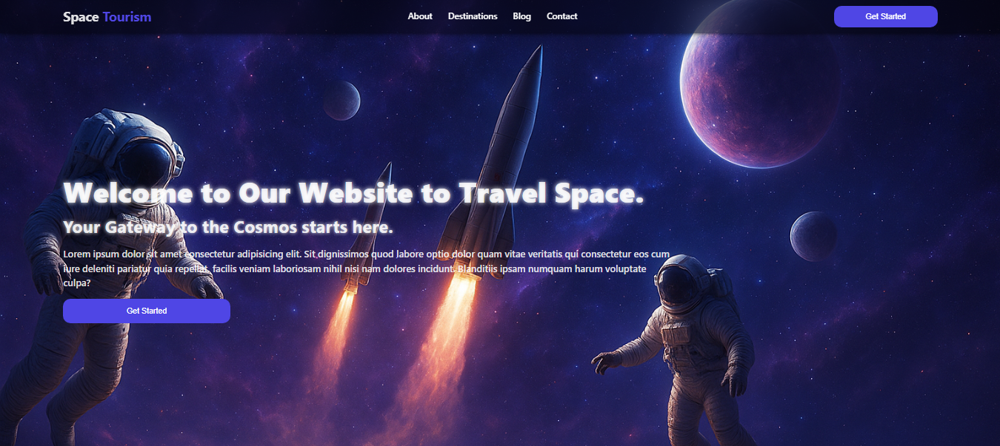

## 🌌 Space Tourism Landing Page

Una landing page moderna y animada creada con **React** y **Framer Motion**, con un hero que incluye **video de fondo** para una experiencia inmersiva.  
Este proyecto es parte de mi aprendizaje en React, enfocado en crear interfaces profesionales para futuros clientes en plataformas como Fiverr.

---

## 🚀 Tecnologías utilizadas

- [React](https://react.dev/) – Librería principal para la construcción de interfaces.
- [Framer Motion](https://www.framer.com/motion/) – Animaciones declarativas y fluidas.
- [CSS3](https://developer.mozilla.org/es/docs/Web/CSS) – Estilos personalizados y responsive design.
- [React Icons](https://react-icons.github.io/react-icons/) – Íconos para redes sociales y botones.
- [Netlify](https://www.netlify.com/) – Hosting y despliegue continuo.

---

## 📂 Estructura del proyecto

├── public/
│ ├── index.html
│ └── favicon.ico
├── src/
│ ├── components/
│ │ ├── Header/
│ │ │ ├── Header.jsx
│ │ │ └── Header.css
│ │ ├── Hero/
│ │ │ ├── Hero.jsx
│ │ │ └── Hero.css
│ │ ├── About/
│ │ │ ├── About.jsx
│ │ │ └── About.css
│ │ ├── Footer/
│ │ │ ├── Footer.jsx
│ │ │ └── Footer.css
│ ├── images/
│ ├── videos/
│ │ └── space.mp4
│ └── App.js
├── package.json
└── README.md

yaml
Copiar código

---

## ✨ Características

- 🎥 **Video background** en la sección Hero.
- 🌌 **Animaciones con Framer Motion** en títulos, subtítulos, textos y botones.
- 📱 **Diseño responsive** adaptado a móviles, tablets y desktop.
- 🎨 **Paleta de colores personalizada** usando `:root` en CSS.
- 🔗 **Footer elegante** con enlaces y redes sociales usando `react-icons`.
- 🎭 **Efectos visuales**: overlays, fade-in, gradientes y más.

---

## ⚡ Instalación y uso

1. Clona el repositorio:
   ```bash
   git clone https://github.com/YoshuaSoto95/landing-page-react-space.git
Entra al proyecto:

bash
Copiar código
cd landing-page-react-space
Instala las dependencias:

bash
Copiar código
npm install
Inicia el servidor de desarrollo:

bash
Copiar código
npm run dev
🌍 Demo
👉 (Agrega aquí el enlace a tu despliegue en Netlify o Vercel)

📸 Capturas


About Section

🛠️ Futuras mejoras
🌠 Añadir un background animado tipo aurora boreal con Framer Motion.

🚀 Implementar un sistema de routing con React Router.

🛰️ Crear un blog dinámico con datos desde un CMS (ej: Strapi o Sanity).

💳 Añadir integración de pago simulado para futuras páginas de ecommerce.

👨‍🚀 Autor
Proyecto desarrollado con ❤️ por Dann Kloppering
Aprendiendo y documentando React + Animaciones para futuros proyectos freelance.